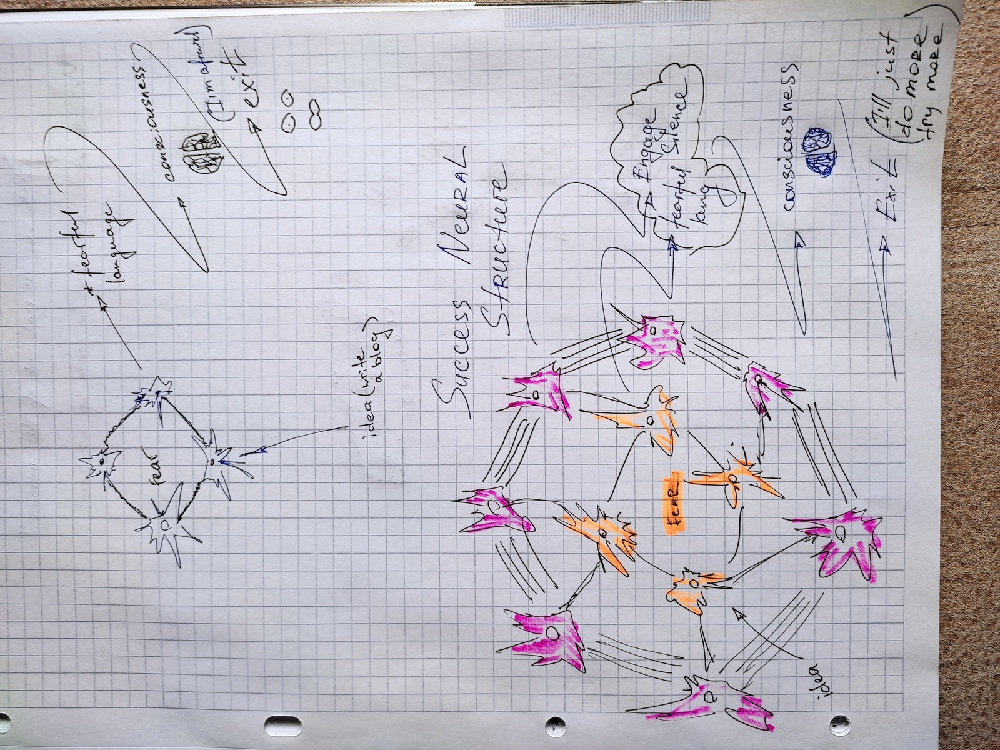
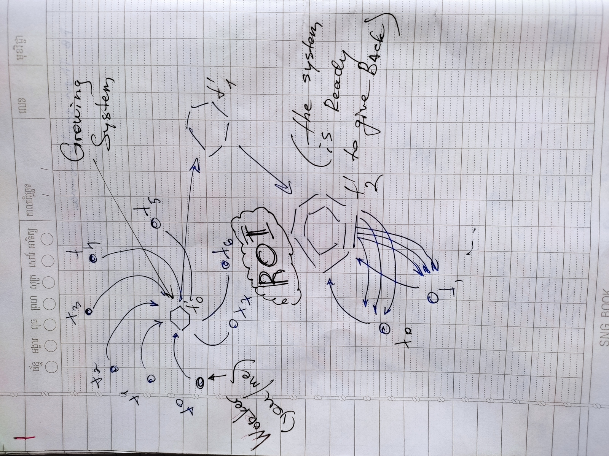

- [Fighting with various Fears](#fighting-with-various-fears)
- [Serendipity](#serendipity)
- [Clarity](#clarity)
- [Future](#future)

Coincidence. I wanted to create my blog for a long time, as you might have known. And it's the false presupposition to start with. What I really wanted is not to *create* a blog but to have my blog *flourish*. The distant reality of having my thoughts and words appreciated, documented, and me having fought and tackled the work ethic issue. There's a hidden player: fear. Fear of not having my blog succeeded.

If we compare the two: to create vs to flourish, then the second might fail. The same way a flower might not be able to grow (flourish), even after you've put the seedling and watered the plant (create).

The time have passed. My brain got better. More experience got written in it, more comprehension of the world. Duality of thinking. Wrong clause. There are not only [I will fail - I will succeed in a span of time] categories of being available. You can fail, learn from it, come back and win. Why such a simple understanding isn't something we learn at schools. 😑

Not far ago when I've started uncovering the mystery of why won't I just start putting myself out there - the youtube algorithm (or rather the stochastic universal dark matter impact of the universe) gave me a suggestion to watch [Ali Abdaal's video](https://www.youtube.com/watch?v=vyVpRiqOvt4). Coincidence. And here we are now.

And now let us check out the main takeaways from the video itself.

# Fighting with various Fears

"I don't know what to write about" ->
Just document the staff you're doing. See, I've watched the video and writing about it. Blending the key points with the stream of thoughts that will come to my conscious view. Structuring it is the main work that I can nominate.

"It's weird. People will judge. I'm not a professional writer." ->
Embrace the beginner's mindset. Why? Imagine you're writing this blog just for yourself. How big of a value is that having the history of your thoughts online? Thus having an ability to get back to them after some time.

Just throw the content out there. That you worked on for some time and did your best at your current ability.
Remember that it takes 10,000 hours to achieve mastery in a certain topic.

# Serendipity
From the category of missed advantages if we're not writing on our blogs.
By starting your blog and/or youtube (robots idea analogy) you inevitably create a product (which is your text or video) that is destined to be read by someone.

Small village. Embrace the technology. Never in the history of civilization were you able to connect with billions of people via the world wide web. And if you don't... you'll die not being heard, not having your individuality expressed to the broad public. And possibly not having your thoughts structured in a "product" based format (A post).

# Clarity
Collapse your conscious quantum field (the superposition of having every thought inside, thinking you're the best in a certain topic - which is Ego talking).

Your stream -> collapse to linear structure of a text. Give it form. Give it meaning. Give it narrative. Chances are: I'll be able to see my mind from a different perspective. Which is valuable. I can witness it already in the process of writing the second post. 

# Future
The most valuable idea from the video that I see is this Daily Project notion by Austin Kleon. First, it's not about having the ideas already and just laying them out on paper so to say. It's me trying to find out what I have to say. Sounds great to me. Let us find out what I have to say, if any.

Second, if you do it daily, you **Will** get to something. It is inevitable. Brace my cells and be ready for my life taking unexpected turns with this. 
(Ali started with his blog, then youtube, then after 3.5 years we can see what's going on now. Beautifully put ideas in production quality videos.)

Let's see what this blog has to offer to me!
- after one month
- after six months
- after twelve months

