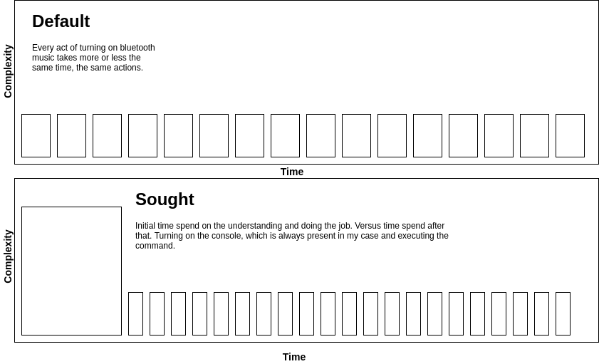

Alright, it will eat me from the inside if I don't write a post about it. Such a simple idea, such big savings in terms of productivity. *At least I currently perceive it to be so.*

# TL; DR

```sh
# ensure bluetooth is on, by rebooting it
rfkill block bluetooth
rfkill unblock bluetooth
# connect to the device via MAC ADRESS handle
# F4:4E:FD:55:C4:9B you must change to your device` MAC ADDRESS value
until bluetoothctl connect F4:4E:FD:55:C4:9B; do  echo ...  ; sleep 1; done
```

# System Requirements
Linux.

I'm using [Pop!_OS by System76](https://pop.system76.com/). Maarvelous system.(Maybe I shall write a review about it :thinking-face:)

# Problem statement [Motivation]

What am I going to talk about? How to pair bluetooth, of course! Don't be a dummy, Ivan, everyone knows how to do that:
- you go to the settings, bluetooth settings;
- you click "turn on the bluetooth";
- you select the device in the list of available devices;
- you click "pair with the device";
- Profit

Right?

Wrong! If I think about it hard enough, that list of doings is just another interface to what computer does internally. And what computer does internally? I'm not sure about the hardware details, but something along the lines of:

- send the signal to bluetooth device; receive the signal back; 
- voila! Connected.

This first, human-centric interface is not actually human-centric. We can do better. That is, less time spent on the issue, more time in the hands of humans.

Here's the complexity - vs - time graph.



Why are we doing all of this you ask?

To save on the clicks and feel ourselves great coz we're pursuing the automatization ideas.


> **Rhetorical, don't read**.
> But this initial task (from the graph, the big box) is what takes me tons of effort, since I need to do something I don't have currently present as a habit. But maybe if I stop thinking about it as an effort it will be much easier? 🤔 What if I think about it as something that will make me happy? Hmmm.

# States and edge cases

It's important to know that even in such a simple task as connect to external device via bluetooth protocol - many things can go wrong. It is almost always cumbersome if one wants to do things programmatically. [That's one of the reasons I quit my job as a programmer, but that's for another story.] So if the script is not working: the problem might lie somewhere in those cases. 

- Bluetooth module is present
- Bluetooth module is not present
- Bluetooth service turned off
- Bluetooth service turned on
- External device is trusted
- External device is not trusted
- External device is paired
- External device is not paired
- External device is connected
- External device is not connected


--------------------------------------------------------------------------------
> If I'm not using my muscles to lift weights - why do I have them?
> 
> If the water is constantly running in my yard - why won't I stop it?
>
> The nature-born waterfall is always running - why can't humans like myself stop it?
> 
> Should I think about saving resources or shall I follow the nature that never does so. How can one know the answer.
--------------------------------------------------------------------------------

# Unnecessary analogies
Device - laptop relationship can only be in one of the following stages.

I imagine this as playing a mario game.
If I'm on the first level - only a certain set of things are available to my experience. Mushrooms, turtles, shades, so on.
If I'd go as far as the last level - even such novel things as a princess and a dragon are available for me to experience.

Thus, if we extrapolate the analogy to the bluetooth problem/situation.
When such a service named bluetooth isn't working - nothing can be done. We must ensure that it's available, that is the most important single step.

On laptop this module is inherently available for most laptops. If we take a desktop PC, on the other hand - we must buy the module separately in most cases! Just to connect our speaker via bluetooth - such a waste of money and effort (how do I even choose and buy the module, the whole lot different story altogether) 🤦‍♂️ 

Outcome #1: we don't have bluetooth available. Well, it's the same as if we're stuck on level one in mario. People on the street would call us a noob, can't afford.

Outcome #2: we have bluetooth available. Awesome. Now we can do some hacking. Even though it's available, it must be turned on first. Another level.

Outcome #2.1: Bluetooth is turned off. Can't work with it. We don't know it yet, but there will be an error (if we try to use bluetooth service without it being turned on):

```sh
No default controller available
```

And we'd bypass the problem by rebooting the bluetooth service.

```sh
rfkill block bluetooth
rfkill unblock bluetooth
```

Outcome #2.2: Bluetooth is turned on. And suddenly I've realised that I put myself too far in the woods with this topic. So let's just jump straight to the conclusion :D

### Conclusion

Not so fast, cowboy! Here's a cookie-making analogy for you. When you are ought to make cookies, you'd first check the website for the ingredients list. Right? Why haven't you stated what we need in order for script to work, the full list?

Because we need only one thing, `Mac Address` of the device we're connecting to.

```sh
bluetoothctl devices

# Example output:
# Device F4:4E:FD:55:C4:9B Nirvana
```

And now for the whole connecting script

```sh
# ensure bluetooth is on, by rebooting it
rfkill block bluetooth
rfkill unblock bluetooth
# connect to the device via MAC ADDRESS handle
# F4:4E:FD:55:C4:9B you must change to your device` MAC ADDRESS value
# experimenting line, needed to bypass the issue where we can't connect to already trusted device. For the next series. (Commented for now)
# until bluetoothctl trust F4:4E:FD:55:C4:9B; do echo ... ; sleep 1; done
until bluetoothctl connect F4:4E:FD:55:C4:9B; do  echo ...  ; sleep 1; done
```

# Finishing touches

How can one run this? Copy here - paste in the terminal.

Is there a way to make it more elegant? There is. 

##### 1. Create a shell script
Choose a name.

Let's say **bnir**.

##### 2. Create a file with extension .sh
Use your file explorer or terminal:
`touch bnir.sh`

##### 3. Fill the contents with:
```sh
#!/bin/bash
# ensure bluetooth is on, by rebooting it
rfkill block bluetooth
rfkill unblock bluetooth
# connect to the device via MAC ADDRESS handle
# F4:4E:FD:55:C4:9B you must change to your device` MAC ADDRESS value
until bluetoothctl connect F4:4E:FD:55:C4:9B; do echo ...  ; sleep 1; done
```

##### 4. Make it executable
`chmod +x ./bnir.sh`

##### 5. Put script into bin folder
`sudo mv ./bnir.sh /usr/bin/`

##### 6. Profit from it
`bnir.sh`

# Farewell
👋
